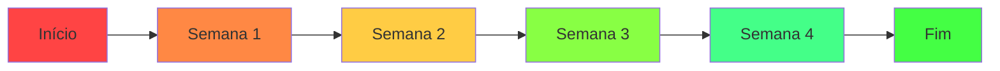

# Dashboard de Monitoramento - Acompanhamento de Pendências

**Data:** 06 de Novembro de 2025  
**Versão:** 1.0  
**Status:** Em Implementação  

## 📊 VISÃO GERAL DO PROGRESSO

### Progresso Geral por Categoria

| Categoria | Total | Concluído | Em Andamento | Pendente | Progresso |
|-----------|-------|-----------|--------------|----------|-----------|
| TypeScript Migration | 125 | 0 | 0 | 125 | 0% |
| Edge Functions | 3 | 0 | 0 | 3 | 0% |
| Qualidade de Código | 5 | 0 | 0 | 5 | 0% |
| Performance | 4 | 0 | 0 | 4 | 0% |
| Monitoramento | 3 | 0 | 0 | 3 | 0% |
| **TOTAL** | **140** | **0** | **0** | **140** | **0%** |

---

## 🎯 DETALHAMENTO DAS PENDÊNCIAS

### 🔴 CRÍTICAS - Alta Prioridade (Semana 1-2)

#### 1. TypeScript Migration - 125 arquivos
**Status:** 🔴 Não Iniciado  
**Responsável:** Equipe de Frontend  
**Deadline:** 20/11/2025  
**Complexidade:** Alta  

**Detalhamento por Bloco:**
```
Bloco 1 - Hooks Principais (15 arquivos)
├── hooks/useAppointments.js ⏳ Pendente
├── hooks/usePatients.js ⏳ Pendente
├── hooks/useAuth.js ⏳ Pendente
├── hooks/useAnalytics.js ⏳ Pendente
└── ... 11 arquivos restantes ⏳ Pendente

Bloco 2 - Services e Utils (25 arquivos)
├── lib/api.js ⏳ Pendente
├── lib/utils.js ⏳ Pendente
├── lib/supabase.js ⏳ Pendente
├── services/patientService.js ⏳ Pendente
└── ... 21 arquivos restantes ⏳ Pendente

Bloco 3 - Components Core (35 arquivos)
├── components/Dashboard.jsx ⏳ Pendente
├── components/PatientList.jsx ⏳ Pendente
├── components/AppointmentCalendar.jsx ⏳ Pendente
└── ... 32 arquivos restantes ⏳ Pendente

Bloco 4 - Contexts e Stores (20 arquivos)
├── contexts/AuthContext.jsx ⏳ Pendente
├── contexts/PatientContext.jsx ⏳ Pendente
├── stores/appointmentStore.js ⏳ Pendente
└⃣ ... 17 arquivos restantes ⏳ Pendente

Bloco 5 - Types e Interfaces (30 arquivos)
├── types/api.js ⏳ Pendente
├── types/models.js ⏳ Pendente
├── types/forms.js ⏳ Pendente
└── ... 27 arquivos restantes ⏳ Pendente
```

#### 2. Edge Functions - 3 funções
**Status:** 🔴 Não Iniciado  
**Responsável:** Equipe de Backend  
**Deadline:** 13/11/2025  
**Complexidade:** Média  

**Detalhamento:**
```
├── whatsapp-webhook ⏳ Pendente
│   ├── Implementação: 0%
│   ├── Testes: 0%
│   ├── Deploy: 0%
│   └── Monitoramento: 0%
│
├── patient-notifications ⏳ Pendente
│   ├── Implementação: 0%
│   ├── Testes: 0%
│   ├── Deploy: 0%
│   └── Monitoramento: 0%
│
└── appointment-reminders ⏳ Pendente
    ├── Implementação: 0%
    ├── Testes: 0%
    ├── Deploy: 0%
    └── Monitoramento: 0%
```

---

### 🟡 IMPORTANTES - Média Prioridade (Semana 3-4)

#### 3. Qualidade de Código - 5 tarefas
**Status:** 🟡 Aguardando Início  
**Responsável:** Equipe de QA  
**Deadline:** 27/11/2025  

**Detalhamento:**
```
├── Padronização nomenclatura BD ⏳ Pendente
│   ├── Análise atual: 0%
│   ├── Renomeação tabelas: 0%
│   ├── Atualização queries: 0%
│   └── Validação: 0%
│
├── Configurar ESLint/Prettier ⏳ Pendente
│   ├── Config base: 0%
│   ├── Regras custom: 0%
│   ├── Integração CI: 0%
│   └── Validação: 0%
│
├── Implementar Husky ⏳ Pendente
│   ├── Pre-commit hooks: 0%
│   ├── Pre-push hooks: 0%
│   ├── Testes automáticos: 0%
│   └── Documentação: 0%
│
├── SonarQube Integration ⏳ Pendente
│   ├── Setup servidor: 0%
│   ├── Config projetos: 0%
│   ├── Quality gates: 0%
│   └── Dashboard: 0%
│
└── Code Review Guidelines ⏳ Pendente
    ├── Documentação: 0%
    ├── Templates PR: 0%
    ├── Checklist: 0%
    └── Treinamento: 0%
```

#### 4. Performance - 4 tarefas
**Status:** 🟡 Aguardando Início  
**Responsável:** Equipe de Performance  
**Deadline:** 04/12/2025  

**Detalhamento:**
```
├── Bundle Analyzer ⏳ Pendente
│   ├── Configuração: 0%
│   ├── Análise inicial: 0%
│   ├── Otimizações: 0%
│   └── Monitoramento: 0%
│
├── Lazy Loading Components ⏳ Pendente
│   ├── Identificação: 0%
│   ├── Implementação: 0%
│   ├── Testes: 0%
│   └── Validação: 0%
│
├── Image Optimization ⏳ Pendente
│   ├── Conversão WebP: 0%
│   ├── Lazy loading: 0%
│   ├── CDN setup: 0%
│   └── Performance: 0%
│
└── Caching Strategy ⏳ Pendente
    ├── Browser cache: 0%
    ├── Service worker: 0%
    ├── API cache: 0%
    └── Invalidação: 0%
```

---

### 🟢 OPCIONAIS - Baixa Prioridade (Semana 5-6)

#### 5. Monitoramento - 3 tarefas
**Status:** 🟢 Planejado  
**Responsável:** Equipe de DevOps  
**Deadline:** 11/12/2025  

**Detalhamento:**
```
├── Sentry Integration ⏳ Pendente
│   ├── Setup SDK: 0%
│   ├── Error tracking: 0%
│   ├── Performance monitoring: 0%
│   └── Alertas: 0%
│
├── Analytics Dashboard ⏳ Pendente
│   ├── GA4 setup: 0%
│   ├── Event tracking: 0%
│   ├── Custom metrics: 0%
│   └── Relatórios: 0%
│
└── Health Check API ⏳ Pendente
    ├── Endpoints: 0%
    ├── Status pages: 0%
    ├── Notificações: 0%
    └── SLA tracking: 0%
```

---

## 📈 MÉTRICAS DE PROGRESSO

### Velocidade de Implementação



### Distribuição de Esforço

| Fase | Duração | Tarefas | Recursos | Esforço Estimado |
|------|---------|---------|----------|------------------|
| Fase 1 - Críticas | 2 semanas | 128 tarefas | 4 desenvolvedores | 320 horas |
| Fase 2 - Importantes | 2 semanas | 9 tarefas | 3 desenvolvedores | 120 horas |
| Fase 3 - Opcionais | 2 semanas | 3 tarefas | 2 desenvolvedores | 48 horas |
| **Total** | **6 semanas** | **140 tarefas** | **9 recursos** | **488 horas** |

---

## 🚨 INDICADORES DE RISCO

### Riscos Identificados

| Risco | Probabilidade | Impacto | Mitigação | Status |
|-------|---------------|---------|-----------|---------|
| Complexidade TypeScript | Alta | Alto | Treinamento intensivo | 🟡 Ativo |
| Dependências externas | Média | Alto | Versionamento estrito | 🟢 Monitorado |
| Mudanças de requisitos | Baixa | Médio | Documentação clara | 🟢 Controlado |
| Indisponibilidade de recursos | Média | Alto | Backup de equipe | 🟢 Preparado |
| Problemas de performance | Baixa | Alto | Testes antecipados | 🟢 Planejado |

---

## 📋 CHECKLIST SEMANAL

### Semana 1 (06-13/11/2025)
- [ ] Configurar ambiente de desenvolvimento
- [ ] Iniciar migração TypeScript - Bloco 1 (Hooks)
- [ ] Implementar Edge Function whatsapp-webhook
- [ ] Configurar ferramentas de qualidade
- [ ] Daily meetings e acompanhamento

### Semana 2 (14-20/11/2025)
- [ ] Completar migração TypeScript - Bloco 1
- [ ] Iniciar migração TypeScript - Bloco 2 (Services)
- [ ] Implementar Edge Functions restantes
- [ ] Primeiros testes de performance
- [ ] Revisão de código e ajustes

### Semana 3 (21-27/11/2025)
- [ ] Completar migração TypeScript - Bloco 2
- [ ] Iniciar migração TypeScript - Bloco 3 (Components)
- [ ] Implementar qualidade de código
- [ ] Configurar monitoramento básico
- [ ] Testes de integração

---

## 🔄 PROCESSO DE ATUALIZAÇÃO

### Frequência de Atualizações
- **Diário:** Progresso de tarefas individuais
- **Semanal:** Métricas de progresso e riscos
- **Quinzenal:** Replanejamento e ajustes
- **Mensal:** Relatório executivo completo

### Responsáveis por Atualizações
- **Tech Lead:** Visão geral e impedimentos
- **Scrum Master:** Processos e ritmo da equipe
- **Desenvolvedores:** Status das tarefas técnicas
- **QA:** Qualidade e testes
- **DevOps:** Infraestrutura e deploy

---

## 📞 CONTATOS E ESCALAÇÃO

### Equipe de Implementação

| Função | Responsável | Contato | Escalonamento |
|--------|-------------|---------|---------------|
| Tech Lead | [Nome] | [Email/Telefone] | CTO |
| Senior Dev | [Nome] | [Email/Telefone] | Tech Lead |
| Frontend Dev | [Nome] | [Email/Telefone] | Senior Dev |
| Backend Dev | [Nome] | [Email/Telefone] | Senior Dev |
| QA Engineer | [Nome] | [Email/Telefone] | QA Lead |
| DevOps | [Nome] | [Email/Telefone] | DevOps Lead |

### Horários de Suporte
- **Horário comercial:** 09:00-18:00 (GMT-3)
- **Plantão emergencial:** 24/7 (críticas apenas)
- **Resposta SLA:** 2h (alta), 8h (média), 24h (baixa)

---

## 🎯 PRÓXIMOS PASSOS

### Ações Imediatas (Próximas 24 horas)
1. **Reunião de Kick-off:** Alinhar expectativas com a equipe
2. **Setup Ambientes:** Preparar dev, staging e produção
3. **Iniciar TypeScript:** Começar com hooks principais
4. **Configurar Monitoramento:** Dashboard de progresso ativo
5. **Comunicação:** Stakeholders informados sobre o plano

### Ações da Semana 1
1. **Migração TypeScript:** Bloco 1 (hooks) - 50% completo
2. **Edge Functions:** WhatsApp webhook implementado
3. **Qualidade:** Ferramentas configuradas
4. **Documentação:** Atualizar conforme progresso
5. **Validação:** Primeiros testes e ajustes

---

**📋 Nota:** Este dashboard será atualizado diariamente com o progresso real das implementações. Todos os membros da equipe têm acesso e responsabilidade de manter suas tarefas atualizadas.

**Última atualização:** 06 de Novembro de 2025 às 14:30  
**Próxima atualização:** 07 de Novembro de 2025 às 09:00  
**Status geral:** 🟡 Em Preparação - Pronto para Início da Implementação