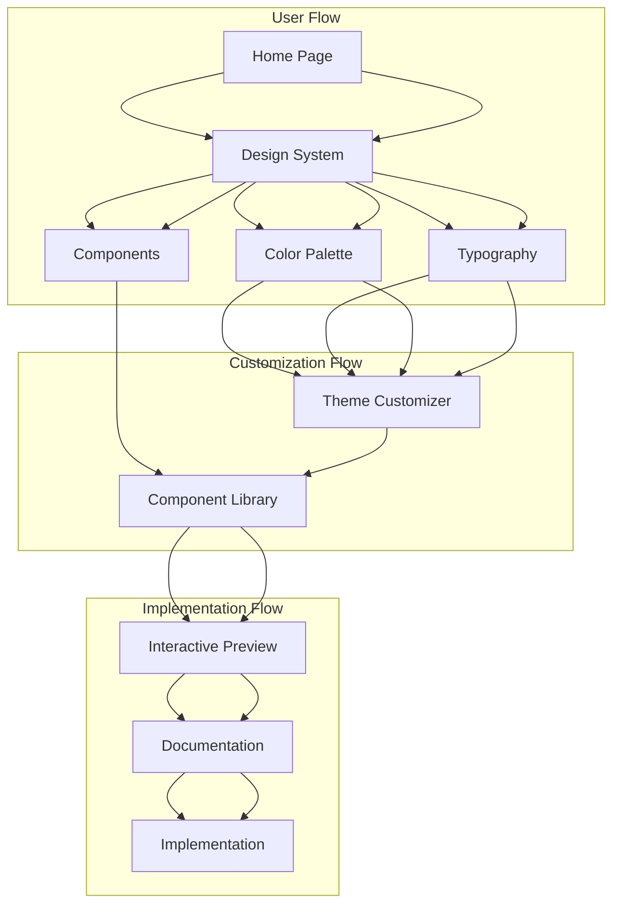

## 1. Product Overview

Sistema de design completo com padrão de layout altamente profissional, elegante e visualmente atraente. O sistema visa fornecer uma experiência visual premium para aplicações web modernas, com foco em profissionalismo e usabilidade excepcional.

O produto resolve a necessidade de interfaces profissionais que transmitam confiança e qualidade, sendo utilizado por empresas e profissionais que buscam excelência em design. O sistema ajuda a criar aplicações com aparência de produto enterprise de alta qualidade.

### Target de Mercado
- Empresas B2B que necessitam de interfaces profissionais
- Startups que buscam transmitir credibilidade através do design
- Profissionais de desenvolvimento que querem agilizar a criação de interfaces elegantes

## 2. Core Features

### 2.1 User Roles
| Role | Registration Method | Core Permissions |
|------|---------------------|------------------|
| Designer | Email registration | Full access to design system, can customize themes |
| Developer | Email registration | Can implement components, access documentation |
| Viewer | No registration required | View-only access to design examples |

### 2.2 Feature Module

O sistema de design profissional consiste nos seguintes módulos principais:

1. **Design System Core**: paleta de cores, tipografia, espaçamentos, componentes base
2. **Component Library**: botões, formulários, cards, navegação, modais
3. **Layout Templates**: headers, footers, grids, containers responsivos
4. **Theme Customizer**: interface para personalização de cores e estilos
5. **Documentation**: guias de uso, exemplos, melhores práticas
6. **Preview System**: demonstração interativa dos componentes

### 2.3 Page Details

| Page Name | Module Name | Feature description |
|-----------|-------------|---------------------|
| Design System | Color Palette | Exibir paleta de cores profissionais com códigos hex, rgb e hsl. Incluir gradientes sutis e variações de tonalidade |
| Design System | Typography | Mostrar hierarquia tipográfica com fontes clean e legíveis. Incluir tamanhos, pesos e espaçamentos |
| Design System | Components | Demonstrar componentes visuais premium: botões com estados visuais, formulários elegantes, cards sofisticados |
| Component Library | Button System | Apresentar variações de botões: primário, secundário, outline, ghost. Incluir estados hover, active, disabled |
| Component Library | Form Elements | Exibir inputs, selects, checkboxes e radio buttons com design refinado e feedback visual |
| Component Library | Navigation | Mostrar menus, breadcrumbs, tabs e navbar com design profissional e consistente |
| Layout Templates | Header Variations | Demonstrar headers responsivos com diferentes níveis de complexidade e elementos |
| Layout Templates | Grid System | Apresentar sistema de grid flexível com breakpoints responsivos e alinhamentos |
| Theme Customizer | Color Editor | Permitir personalização dinâmica da paleta de cores com preview em tempo real |
| Theme Customizer | Typography Editor | Possibilitar ajuste de fontes, tamanhos e espaçamentos com visualização instantânea |
| Documentation | Usage Guidelines | Fornecer instruções detalhadas sobre implementação e melhores práticas de uso |
| Documentation | Code Examples | Exibir snippets de código para cada componente com diferentes frameworks |
| Preview System | Interactive Demo | Permitir interação com todos os componentes para teste de usabilidade |
| Preview System | Responsive Preview | Mostrar como os componentes se comportam em diferentes tamanhos de tela |

## 3. Core Process

### Fluxo Principal do Usuário
1. Usuário acessa o Design System
2. Visualiza a paleta de cores e tipografia base
3. Explora os componentes disponíveis
4. Personaliza o tema através do Theme Customizer
5. Testa os componentes no Preview System
6. Acessa a documentação para implementação
7. Baixa ou copia o código dos componentes

### Fluxo do Designer
1. Designer acessa o sistema com login
2. Cria ou edita temas personalizados
3. Exporta configurações de tema
4. Compartilha temas com a equipe

### Fluxo do Desenvolvedor
1. Desenvolvedor navega pela documentação
2. Copia código dos componentes necessários
3. Implementa no projeto utilizando o design system
4. Testa responsividade e estados visuais

## 4. User Interface Design

### 4.1 Design Style

**Esquema de Cores Principal:**
- Cor Primária: `#2563eb` (Azul profissional)
- Cor Secundária: `#64748b` (Cinza sofisticado)
- Cor de Destaque: `#0ea5e9` (Azul vibrante)
- Cor de Sucesso: `#10b981` (Verde elegante)
- Cor de Aviso: `#f59e0b` (Âmbar premium)
- Cor de Erro: `#ef4444` (Vermelho clean)
- Background Primário: `#ffffff` (Branco puro)
- Background Secundário: `#f8fafc` (Cinza muito claro)
- Texto Primário: `#1e293b` (Cinza escuro profissional)
- Texto Secundário: `#64748b` (Cinza médio)

**Tipografia:**
- Fonte Principal: 'Inter', sans-serif (moderna e legível)
- Fonte de Destaque: 'Playfair Display', serif (elegante para títulos)
- Tamanhos: 12px, 14px, 16px, 18px, 20px, 24px, 32px, 48px
- Pesos: 300 (light), 400 (regular), 500 (medium), 600 (semibold), 700 (bold)

**Elementos Visuais:**
- Botões: border-radius de 8px, sombras sutis, transições suaves de 200ms
- Cards: border-radius de 12px, sombras elegantes, padding consistente
- Formulários: bordas de 1px, focus states com anéis de destaque
- Ícones: Estilo outline clean, tamanhos padronizados (16px, 20px, 24px)

**Efeitos Visuais:**
- Sombras: `box-shadow: 0 1px 3px rgba(0,0,0,0.1)` para elementos leves
- Gradientes: Gradientes lineares sutis para backgrounds de destaque
- Transparência: Uso moderado de `rgba()` para sobreposições elegantes
- Animações: Transições de 200-300ms com easing natural

### 4.2 Page Design Overview

| Page Name | Module Name | UI Elements |
|-----------|-------------|-------------|
| Home Page | Hero Section | Background gradient sutil, título com fonte Playfair Display 48px, subtítulo Inter 18px, CTA button primário com hover effect |
| Design System | Color Palette | Grid de cores com códigos hex visíveis, amostras circulares de 80px, gradientes demonstrados em cards elegantes |
| Design System | Typography | Hierarquia visual clara com exemplos de textos, comparação lado a lado de fontes, escala tipográfica vertical |
| Component Library | Button System | Grid de botões com estados visuais, demonstração de tamanhos, variações agrupadas logicamente |
| Component Library | Form Elements | Formulário demo com labels elegantes, validação visual, estados de focus com anéis de destaque |
| Layout Templates | Header Variations | Headers responsivos com menu hamburger para mobile, navegação clara e consistente |
| Theme Customizer | Color Editor | Color pickers profissionais, preview em tempo real, exportação de configurações |
| Documentation | Code Examples | Syntax highlighting elegante, tabs para diferentes frameworks, copy-to-clipboard funcional |
| Preview System | Interactive Demo | Interface limpa com sidebar de navegação, preview central, controles intuitivos |

### 4.3 Responsiveness

**Desktop-First Approach:**
- Breakpoints: 1920px, 1440px, 1024px, 768px, 640px, 375px
- Grid System: 12 colunas com gutters de 24px (desktop) e 16px (mobile)
- Container Max-width: 1280px para conteúdo principal

**Mobile Optimization:**
- Touch targets mínimos de 44px x 44px
- Font sizes adaptativos: 16px mínimo para inputs
- Espaçamentos aumentados para melhor usabilidade touch
- Menu mobile com transições suaves e overlay escuro

**Estados de Interação:**
- Hover: Transições suaves de cor e elevação
- Active: Feedback visual imediato com scale(0.98) e shadow reduction
- Focus: Anéis de destaque com 2px de largura e cor primária
- Disabled: Opacidade de 50% com cursor not-allowed

**Animações e Transições:**
- Duração padrão: 200ms para transições simples, 300ms para complexas
- Easing: cubic-bezier(0.4, 0, 0.2, 1) para movimentos naturais
- Page transitions: Fade-in de 400ms ao carregar novas páginas
- Scroll animations: Parallax suave para elementos de destaque