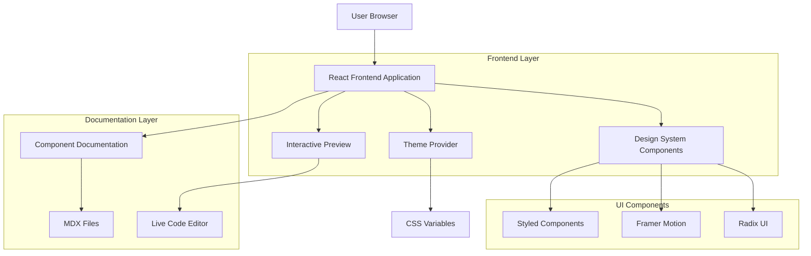
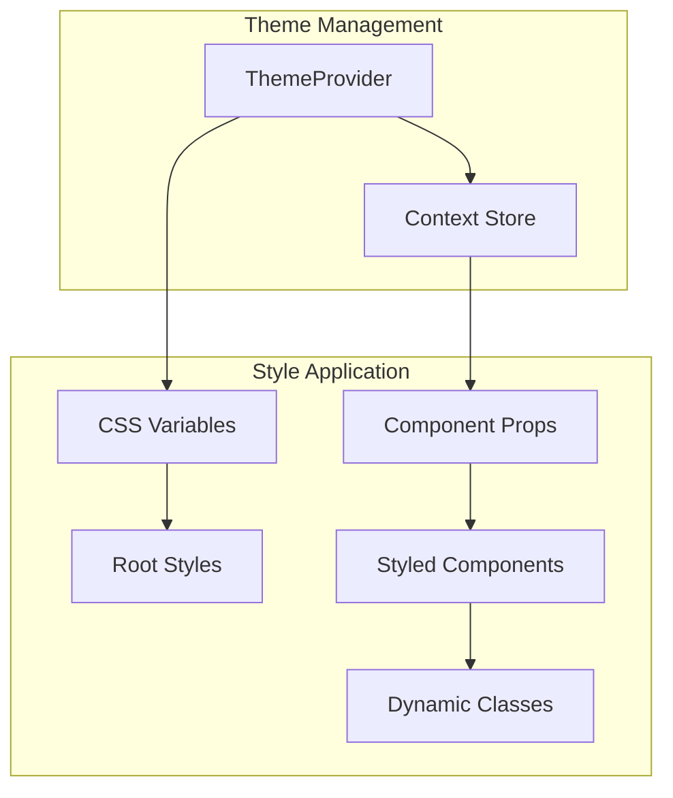

## 1. Architecture Design



## 2. Technology Description

* Frontend: React\@18 + TypeScript\@5 + Vite

* Styling: Styled Components\@6 + TailwindCSS\@3 + CSS Variables

* Component Library: Radix UI\@1 + Headless UI

* Animations: Framer Motion\@10 + CSS Transitions

* Documentation: Storybook\@7 + MDX

* Theme System: CSS Custom Properties + Context API

* Build Tool: Vite\@5

* Package Manager: pnpm

* Initialization Tool: vite-init

## 3. Route Definitions

| Route                     | Purpose                                  |
| ------------------------- | ---------------------------------------- |
| /                         | Home page, apresentação do design system |
| /design-system            | Visão geral do sistema de design         |
| /design-system/colors     | Paleta de cores e gradientes             |
| /design-system/typography | Sistema tipográfico e hierarquia         |
| /design-system/components | Documentação de componentes              |
| /components/buttons       | Galeria de variações de botões           |
| /components/forms         | Elementos de formulário                  |
| /components/navigation    | Componentes de navegação                 |
| /components/cards         | Layout de cards e containers             |
| /layout/headers           | Templates de cabeçalho                   |
| /layout/grids             | Sistema de grid responsivo               |
| /theme/customizer         | Ferramenta de personalização             |
| /preview/interactive      | Demo interativo dos componentes          |
| /docs/usage               | Guias de implementação                   |
| /docs/code-examples       | Snippets de código                       |

## 4. Component Architecture

### 4.1 Core Component Structure

```typescript
// Base Component Interface
interface BaseComponent {
  variant?: 'primary' | 'secondary' | 'outline' | 'ghost';
  size?: 'sm' | 'md' | 'lg' | 'xl';
  state?: 'default' | 'hover' | 'active' | 'disabled';
  className?: string;
  children: React.ReactNode;
}

// Theme Interface
interface ThemeConfig {
  colors: {
    primary: string;
    secondary: string;
    accent: string;
    success: string;
    warning: string;
    error: string;
    background: string;
    surface: string;
    text: string;
    textSecondary: string;
  };
  typography: {
    fontFamily: {
      primary: string;
      secondary: string;
      mono: string;
    };
    fontSize: Record<string, string>;
    fontWeight: Record<string, number>;
    lineHeight: Record<string, string>;
  };
  spacing: Record<string, string>;
  borderRadius: Record<string, string>;
  shadows: Record<string, string>;
  transitions: {
    duration: Record<string, string>;
    easing: Record<string, string>;
  };
}
```

### 4.2 Component Categories

**Foundation Components:**

* ColorPalette: Visualização de cores com códigos

* TypographyScale: Hierarquia tipográfica demonstrada

* SpacingSystem: Grid e espaçamentos visuais

**Input Components:**

* Button: Variações completas com estados

* Input: Campos de formulário elegantes

* Select: Dropdowns sofisticados

* Checkbox/Radio: Elementos de seleção premium

**Layout Components:**

* Card: Containers com sombras e bordas

* Header: Templates de navegação

* Grid: Sistema de grid responsivo

* Container: Limitadores de largura

**Feedback Components:**

* Alert: Mensagens de status profissionais

* Modal: Diálogos elegantes com animações

* Toast: Notificações discretas

* Loading: Indicadores visuais sofisticados

## 5. Theme System Architecture



### 5.1 CSS Variables Structure

```css
:root {
  /* Colors */
  --color-primary: #2563eb;
  --color-secondary: #64748b;
  --color-accent: #0ea5e9;
  --color-success: #10b981;
  --color-warning: #f59e0b;
  --color-error: #ef4444;
  
  /* Typography */
  --font-primary: 'Inter', sans-serif;
  --font-secondary: 'Playfair Display', serif;
  --font-size-xs: 0.75rem;
  --font-size-sm: 0.875rem;
  --font-size-base: 1rem;
  --font-size-lg: 1.125rem;
  --font-size-xl: 1.25rem;
  --font-size-2xl: 1.5rem;
  --font-size-3xl: 1.875rem;
  --font-size-4xl: 2.25rem;
  
  /* Spacing */
  --spacing-1: 0.25rem;
  --spacing-2: 0.5rem;
  --spacing-3: 0.75rem;
  --spacing-4: 1rem;
  --spacing-5: 1.25rem;
  --spacing-6: 1.5rem;
  --spacing-8: 2rem;
  --spacing-10: 2.5rem;
  --spacing-12: 3rem;
  
  /* Border Radius */
  --radius-sm: 0.25rem;
  --radius-md: 0.375rem;
  --radius-lg: 0.5rem;
  --radius-xl: 0.75rem;
  --radius-2xl: 1rem;
  
  /* Shadows */
  --shadow-sm: 0 1px 2px 0 rgb(0 0 0 / 0.05);
  --shadow-md: 0 4px 6px -1px rgb(0 0 0 / 0.1);
  --shadow-lg: 0 10px 15px -3px rgb(0 0 0 / 0.1);
  --shadow-xl: 0 20px 25px -5px rgb(0 0 0 / 0.1);
}
```

## 6. Component Documentation Structure

### 6.1 Storybook Configuration

```typescript
// .storybook/preview.tsx
import { ThemeProvider } from '../src/contexts/ThemeContext';

export const decorators = [
  (Story) => (
    <ThemeProvider>
      <Story />
    </ThemeProvider>
  ),
];

export const parameters = {
  actions: { argTypesRegex: '^on[A-Z].*' },
  controls: {
    matchers: {
      color: /(background|color)$/i,
      date: /Date$/,
    },
  },
  backgrounds: {
    default: 'light',
    values: [
      { name: 'light', value: '#ffffff' },
      { name: 'dark', value: '#1e293b' },
      { name: 'gray', value: '#f8fafc' },
    ],
  },
};
```

### 6.2 Component Story Template

```typescript
// src/components/Button/Button.stories.tsx
import type { Meta, StoryObj } from '@storybook/react';
import { Button } from './Button';

const meta: Meta<typeof Button> = {
  title: 'Components/Button',
  component: Button,
  parameters: {
    layout: 'centered',
  },
  tags: ['autodocs'],
  argTypes: {
    variant: {
      control: { type: 'select' },
      options: ['primary', 'secondary', 'outline', 'ghost'],
    },
    size: {
      control: { type: 'select' },
      options: ['sm', 'md', 'lg', 'xl'],
    },
    disabled: {
      control: 'boolean',
    },
  },
};

export default meta;
type Story = StoryObj<typeof meta>;

export const Primary: Story = {
  args: {
    variant: 'primary',
    size: 'md',
    children: 'Button',
  },
};

export const Variants: Story = {
  render: () => (
    <div className="flex gap-4">
      <Button variant="primary">Primary</Button>
      <Button variant="secondary">Secondary</Button>
      <Button variant="outline">Outline</Button>
      <Button variant="ghost">Ghost</Button>
    </div>
  ),
};
```

## 7. Build and Development Workflow

### 7.1 Development Scripts

```json
{
  "scripts": {
    "dev": "vite",
    "build": "tsc && vite build",
    "preview": "vite preview",
    "storybook": "storybook dev -p 6006",
    "build-storybook": "storybook build",
    "lint": "eslint . --ext ts,tsx --report-unused-disable-directives --max-warnings 0",
    "type-check": "tsc --noEmit"
  }
}
```

### 7.2 Build Optimization

* Tree-shaking para remover código não utilizado

* Code-splitting por rotas e componentes

* Otimização de imagens e assets

* Minificação de CSS e JavaScript

* Geração de source maps para debugging

## 8. Testing Strategy

### 8.1 Unit Testing

* Jest + React Testing Library para componentes

* Testes de acessibilidade com jest-axe

* Testes visuais com snapshot testing

### 8.2 Integration Testing

* Testes de interação entre componentes

* Testes de tema e customização

* Testes responsivos com viewport simulation

### 8.3 Visual Regression Testing

* Chromatic ou Percy para detectar mudanças visuais

* Screenshots automatizadas dos componentes

* Comparação visual entre versões

