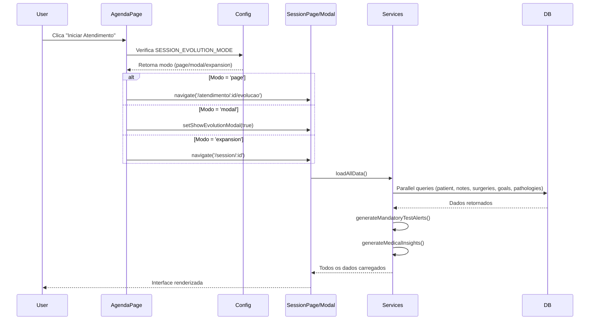
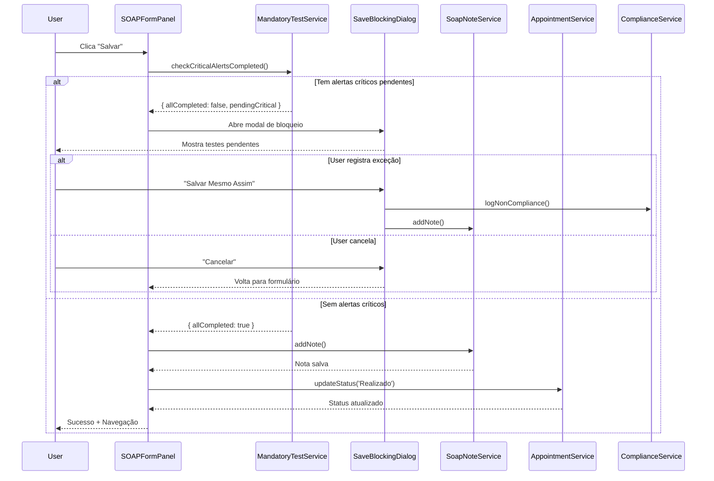
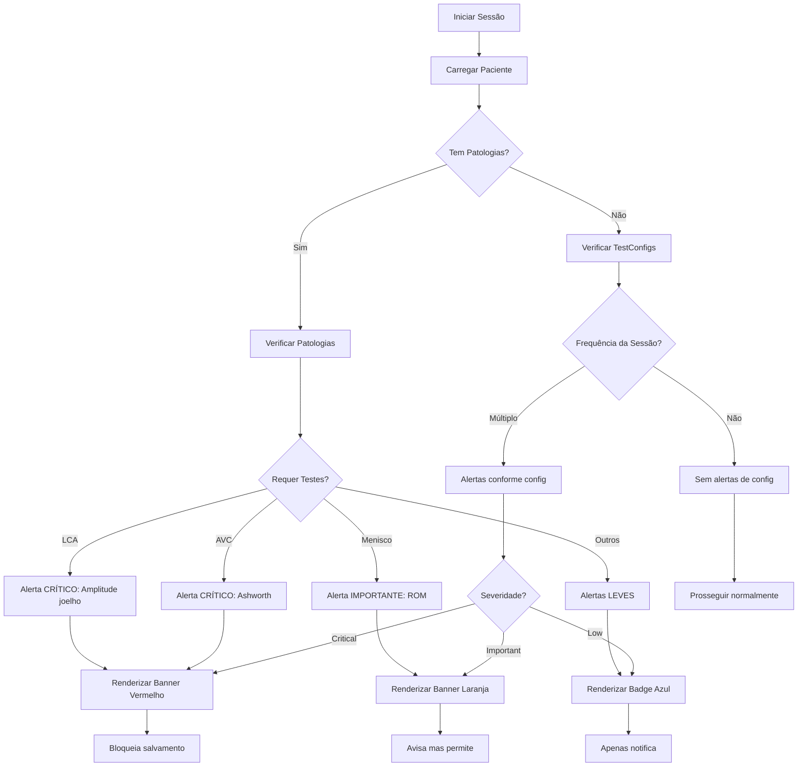

# Arquitetura do Sistema de Evolução de Sessão

## Visão Geral da Arquitetura

O Sistema de Evolução de Sessão segue uma arquitetura em camadas com separação clara de responsabilidades:

```
┌─────────────────────────────────────────────────────────────┐
│                    APRESENTAÇÃO (UI)                         │
│  ┌──────────────┬───────────────┬────────────────────────┐  │
│  │ Opção 1      │ Opção 2       │ Opção 3                │  │
│  │ SessionEvo-  │ SessionEvo-   │ SessionFormPage        │  │
│  │ lutionPage   │ lutionModal   │ (Expandida)            │  │
│  └──────────────┴───────────────┴────────────────────────┘  │
│                           │                                  │
│                           ↓                                  │
│            SessionEvolutionContainer                         │
│               (Orchestrator + Layout)                        │
└─────────────────────────────────────────────────────────────┘
                            │
                            ↓
┌─────────────────────────────────────────────────────────────┐
│              COMPONENTES (32 Components)                     │
│  ┌──────────┬──────────┬──────────┬──────────┐             │
│  │ Col 1    │ Col 2    │ Col 3    │ Col 4    │             │
│  │ SOAP     │ History  │ Tests    │ Summary  │             │
│  │ (30%)    │ (25%)    │ (25%)    │ (20%)    │             │
│  └──────────┴──────────┴──────────┴──────────┘             │
└─────────────────────────────────────────────────────────────┘
                            │
                            ↓
┌─────────────────────────────────────────────────────────────┐
│                 SERVIÇOS (8 Services)                        │
│  • surgeryService          • testEvolutionService           │
│  • patientGoalsService     • conductReplicationService      │
│  • pathologyService        • sessionEvolutionService        │
│  • mandatoryTestAlertService                                │
│  • medicalReportSuggestionsService                          │
└─────────────────────────────────────────────────────────────┘
                            │
                            ↓
┌─────────────────────────────────────────────────────────────┐
│               CAMADA DE DADOS                                │
│  ┌─────────────────┬──────────────────┐                     │
│  │ Supabase (Prod) │ Mock (Dev/Test)  │                     │
│  └─────────────────┴──────────────────┘                     │
└─────────────────────────────────────────────────────────────┘
```

## Camada de Apresentação (UI)

### 3 Opções de Interface

#### 1. SessionEvolutionPage (page)
**Arquivo**: `pages/SessionEvolutionPage.tsx`
**Rota**: `/atendimento/:appointmentId/evolucao`

```typescript
interface Props {
  // Nenhuma prop - usa useParams() para appointmentId
}
```

**Características**:
- Página dedicada fullscreen
- Navegação por URL
- Tabs para mobile/tablet
- Botão "Voltar para Agenda"
- Ideal para workflows longos

#### 2. SessionEvolutionModal (modal)
**Arquivo**: `components/session/SessionEvolutionModal.tsx`
**z-index**: 9999

```typescript
interface Props {
  isOpen: boolean;
  appointmentId: string;
  onClose: () => void;
  onSave?: () => void;
}
```

**Características**:
- Modal fullscreen sobre agenda
- Animações com Framer Motion
- Backdrop com blur
- Fechamento com Esc
- Ideal para consultas rápidas

#### 3. SessionFormPage Expandida (expansion)
**Arquivo**: `pages/SessionFormPage.tsx`

```typescript
interface Props {
  appointmentId: string;
  onClose: () => void;
}
```

**Características**:
- Expande interface existente
- Modal sobre agenda (como versão atual)
- 4 colunas ao invés de 3
- Compatibilidade com fluxo antigo

### Sistema de Toggle

**Arquivo**: `config/sessionEvolutionConfig.ts`

```typescript
export type SessionEvolutionMode = 'page' | 'modal' | 'expansion';
export const SESSION_EVOLUTION_MODE: SessionEvolutionMode = 'modal';
```

**Hook**: `hooks/useSessionEvolutionMode.tsx`

```typescript
const { mode, setMode, isLoading } = useSessionEvolutionMode();
// Permite alterar modo em runtime
// Salva preferência no localStorage
// TODO: Sincronizar com Supabase
```

## Camada de Componentes

### Arquitetura de 4 Colunas

```
┌──────────────────────────────────────────────────────────────┐
│  [Col 1: 30%] │ [Col 2: 25%] │ [Col 3: 25%] │ [Col 4: 20%] │
│  Formulário   │ Histórico    │ Testes       │ Resumo       │
│  SOAP         │ & Condutas   │ & Evolução   │ Paciente     │
└──────────────────────────────────────────────────────────────┘
```

### Coluna 1: Formulário SOAP (30%)

**Componente Principal**: `SOAPFormPanel.tsx`

```typescript
interface SOAPFormPanelProps {
  patientId: string;
  sessionNumber: number;
  previousNote?: SoapNote | null;
  onSave: (data: Omit<SoapNote, 'id' | 'patientId' | 'therapist'>) => Promise<void>;
  onCancel?: () => void;
  isLoading?: boolean;
}
```

**Sub-componentes**:
- Editor de texto (SimpleSoapEditor)
- Validação inline
- Contador de caracteres
- Botão "Replicar Conduta"
- Auto-save com debounce (2.5s)

**Estado**:
```typescript
{
  subjective: string;
  objective: string;
  assessment: string;
  plan: string;
  painScale?: number;
  bodyParts: string[];
  isDirty: boolean;
  mandatoryAlerts: MandatoryTestAlert[];
}
```

### Coluna 2: Histórico & Cirurgias (25%)

**Componentes**:

1. **SessionHistoryPanel** - Últimas 10 sessões
```typescript
interface SessionHistoryPanelProps {
  patientNotes: SoapNote[];
  onRepeatConduct: (note: SoapNote) => void;
}
```

2. **SurgeryTimeline** - Timeline de cirurgias
```typescript
interface SurgeryTimelineProps {
  surgeries: Surgery[];
  patientId: string;
  onUpdate: () => void;
}
```
- Badge com tempo decorrido
- Indicador de fase pós-operatória
- CRUD completo via `SurgeryFormModal`

3. **TreatmentDurationCard** - Duração do tratamento
```typescript
interface TreatmentDurationCardProps {
  patientId: string;
  firstSessionDate?: string;
}
```

### Coluna 3: Testes & Evolução (25%)

**Componentes**:

1. **MandatoryTestAlert** - Alertas obrigatórios
```typescript
interface MandatoryTestAlertProps {
  alert: MandatoryTestAlert;
  onMarkCompleted: () => void;
}
```
- 3 níveis de severidade (critical, important, low)
- Cores diferenciadas
- Ações específicas por nível

2. **PathologyManager** - Gerenciamento de patologias
```typescript
interface PathologyManagerProps {
  patientId: string;
  pathologies: Pathology[];
  onUpdate: () => void;
}
```
- Seção "Em Tratamento"
- Seção "Tratadas/Resolvidas"
- CRUD via `PathologyFormModal`

3. **TestEvolutionPanel** - Gráficos e tabelas
```typescript
interface TestEvolutionPanelProps {
  patientId: string;
}
```
- Seletor de métrica
- Seletor de tipo de gráfico
- `EvolutionChart` (Recharts)
- `EvolutionTable` (ordenável, exportável)

### Coluna 4: Resumo & Objetivos (20%)

**Componentes**:

1. **PatientOverview** - Info básica
```typescript
interface PatientOverviewProps {
  patient: Patient;
}
```
- Nome, idade, foto
- Contato rápido (WhatsApp)

2. **PatientGoalsPanel** - Objetivos com countdown
```typescript
interface PatientGoalsPanelProps {
  patientId: string;
  goals: PatientGoal[];
  onUpdate: () => void;
}
```
- `GoalCountdown` - Countdown animado
- `GoalFormModal` - CRUD
- Barra de progresso
- Badge de prioridade

3. **PatientMetrics** - Métricas rápidas
```typescript
interface PatientMetricsProps {
  patient: Patient;
  appointments: Appointment[];
}
```

4. **MedicalReportSuggestions** - Insights
```typescript
interface MedicalReportSuggestionsProps {
  insights: MedicalInsight[];
}
```

## Camada de Serviços

### Arquitetura de Services

Todos os services seguem o mesmo padrão:

```typescript
// 1. Imports
import { EntityType } from '../types';
import { shouldUseSupabase, logDataSource } from '../config/supabaseTablesConfig';

// 2. Dual Mode Functions
async function getFromSupabase(id: string): Promise<EntityType[]> { }
async function getFromMock(id: string): Promise<EntityType[]> { }

// 3. CRUD Operations (Unified)
export async function getEntities(id: string): Promise<EntityType[]> {
  try {
    if (shouldUseSupabase()) {
      try {
        return await getFromSupabase(id);
      } catch (error) {
        if (shouldFallbackToMock()) {
          return await getFromMock(id);
        }
        throw error;
      }
    }
    return await getFromMock(id);
  } catch (error) {
    console.error('Erro:', error);
    throw error;
  }
}

// 4. Helper Functions
export function calculateSomething(data: EntityType): string { }
export function formatSomething(data: EntityType): FormattedType { }
```

### Services por Responsabilidade

#### 1. surgeryService.ts
**Responsabilidades**:
- CRUD de cirurgias
- Cálculo de tempo decorrido
- Identificação de fase pós-operatória
- Cirurgias recentes vs antigas

**Funções principais**:
```typescript
getSurgeriesByPatientId(patientId: string): Promise<Surgery[]>
addSurgery(patientId: string, surgery: Omit<Surgery, 'id'>): Promise<Surgery>
calculateTimeSinceSurgery(surgeryDate: string): string
formatSurgeryInfo(surgery: Surgery): { timeSince, phase, isCritical }
getRecentSurgeries(patientId: string, daysThreshold?: number): Promise<Surgery[]>
```

#### 2. patientGoalsService.ts
**Responsabilidades**:
- CRUD de objetivos/metas
- Cálculo de countdown
- Atualização de progresso
- Marcação de conclusão

**Funções principais**:
```typescript
getGoalsByPatientId(patientId: string): Promise<PatientGoal[]>
addGoal(patientId: string, goal: Omit<PatientGoal, 'id'>): Promise<PatientGoal>
calculateCountdown(targetDate: string): { days, formatted }
updateGoalProgress(goalId: string, progress: number): Promise<PatientGoal>
markGoalCompleted(goalId: string): Promise<PatientGoal>
```

#### 3. pathologyService.ts
**Responsabilidades**:
- CRUD de patologias
- Filtros por status
- Sugestões de testes obrigatórios
- Formatação de informações

**Funções principais**:
```typescript
getPathologiesByPatientId(patientId: string): Promise<Pathology[]>
getActivePathologies(patientId: string): Promise<Pathology[]>
getResolvedPathologies(patientId: string): Promise<Pathology[]>
markAsResolved(pathologyId: string): Promise<Pathology>
requiresMandatoryTests(pathology: Pathology): boolean
suggestMandatoryTests(pathology: Pathology): string[]
```

#### 4. testEvolutionService.ts
**Responsabilidades**:
- Evolução de testes ao longo do tempo
- Estatísticas de testes
- Dados para gráficos
- Export CSV

**Funções principais**:
```typescript
getTestEvolutionData(patientId: string, testName: string): Promise<TestEvolutionData[]>
getTestHistory(patientId: string): Promise<Map<string, TestEvolutionData[]>>
getTestStatistics(patientId: string, testName: string): Promise<TestStatistics>
getBilateralComparison(patientId: string, testName: string): Promise<{left, right, difference}>
formatForChart(data: TestEvolutionData[]): { labels, values, sessionNumbers }
exportToCSV(data: TestEvolutionData[], testName: string): string
```

#### 5. conductReplicationService.ts
**Responsabilidades**:
- Templates de conduta
- Replicação entre sessões
- Condutas mais usadas
- Import/Export JSON

**Funções principais**:
```typescript
getSavedConducts(patientId: string): Promise<ConductTemplate[]>
saveConductAsTemplate(patientId, conduct, name): Promise<ConductTemplate>
replicateConduct(conductId: string): Promise<ConductTemplate>
getRecentConducts(patientId: string, limit: number): Promise<ConductTemplate[]>
applyTemplate(template: ConductTemplate): { subjective, objective, assessment, plan }
applyPartialTemplate(template, fields): { selectedFields }
```

#### 6. sessionEvolutionService.ts
**Responsabilidades**:
- CRUD de evoluções de sessão
- Resumos de sessão
- Sessões recentes
- Estatísticas gerais

**Funções principais**:
```typescript
getSessionEvolution(sessionId: string): Promise<SessionEvolution | null>
saveSessionEvolution(data): Promise<SessionEvolution>
getEvolutionsByPatientId(patientId: string): Promise<SessionEvolution[]>
getRecentSessions(patientId: string, limit: number): Promise<SessionEvolution[]>
getSessionSummary(patientId: string): Promise<SessionSummary>
```

#### 7. mandatoryTestAlertService.ts
**Responsabilidades**:
- Geração de alertas
- Verificação de compliance
- Log de exceções
- Histórico de alertas

**Funções principais**:
```typescript
generateMandatoryTestAlerts(patientId, sessionNumber): Promise<MandatoryTestAlert[]>
checkCriticalAlertsCompleted(patientId, sessionId, sessionNumber): Promise<{allCompleted, pendingCritical, pendingImportant}>
formatAlertMessage(alert): { icon, color, bgColor, title, canBypass }
logTestException(patientId, sessionId, alert, reason, userId): Promise<void>
calculateComplianceRate(patientId): Promise<{totalAlerts, completedAlerts, complianceRate}>
```

#### 8. medicalReportSuggestionsService.ts
**Responsabilidades**:
- Geração automática de insights
- Análise temporal de evolução
- Sugestões de texto para laudos
- Relatórios executivos

**Funções principais**:
```typescript
generateMedicalInsights(patientId: string): Promise<MedicalInsight[]>
generateFullMedicalReport(patientId: string): Promise<string>
generateExecutiveSummary(patientId: string): Promise<string>
// Funções internas:
generatePainReductionInsights(patientId): Promise<MedicalInsight[]>
generateRangeImprovementInsights(patientId): Promise<MedicalInsight[]>
generateStrengthGainInsights(patientId): Promise<MedicalInsight[]>
generateFunctionalProgressInsights(patientId): Promise<MedicalInsight[]>
generateMilestoneInsights(patientId): Promise<MedicalInsight[]>
```

## Fluxo de Dados

### Fluxo de Inicialização



### Fluxo de Salvamento



### Fluxo de Alertas



## Sistema de Alertas (3 Níveis)

### Níveis de Severidade

```typescript
type AlertSeverity = 'critical' | 'important' | 'low';

interface AlertConfig {
  critical: {
    icon: '🚨';
    color: 'text-red-800';
    bgColor: 'bg-red-50';
    borderColor: 'border-red-300';
    blocksSave: true;
  };
  important: {
    icon: '⚠️';
    color: 'text-orange-800';
    bgColor: 'bg-orange-50';
    borderColor: 'border-orange-300';
    blocksSave: false;
  };
  low: {
    icon: 'ℹ️';
    color: 'text-blue-800';
    bgColor: 'bg-blue-50';
    borderColor: 'border-blue-300';
    blocksSave: false;
  };
}
```

### Matriz de Decisão de Alertas

| Patologia | Teste Obrigatório | Severidade | Bloqueia? |
|-----------|-------------------|------------|-----------|
| LCA | Amplitude joelho | CRÍTICO | ✅ Sim |
| LCA | Teste de Lachman | IMPORTANTE | ❌ Não |
| AVC | Escala Ashworth | CRÍTICO | ✅ Sim |
| AVC | Força muscular | IMPORTANTE | ❌ Não |
| Menisco | Amplitude joelho | IMPORTANTE | ❌ Não |
| Fratura | Amplitude | IMPORTANTE | ❌ Não |
| Artrose | Dor (EVA) | LEVE | ❌ Não |

## Sistema de Insights Automáticos

### Pipeline de Geração

```typescript
generateMedicalInsights(patientId)
  ├─> generatePainReductionInsights()
  │   └─> Analisa evolução da dor (EVA)
  │       ├─> Identifica reduções significativas
  │       ├─> Detecta ausência completa de dor
  │       └─> Gera texto sugerido para laudo
  │
  ├─> generateRangeImprovementInsights()
  │   └─> Analisa testes de amplitude
  │       ├─> Calcula ganhos percentuais
  │       └─> Gera texto técnico
  │
  ├─> generateStrengthGainInsights()
  │   └─> Analisa evolução de força
  │       ├─> Compara graus de força (0-5)
  │       └─> Identifica ganhos significativos
  │
  ├─> generateFunctionalProgressInsights()
  │   └─> Analisa testes funcionais
  │       ├─> Marcha, equilíbrio, etc.
  │       └─> Melhoras >10%
  │
  ├─> generateMilestoneInsights()
  │   └─> Identifica marcos importantes
  │       ├─> Retorno ao esporte
  │       ├─> Tratamento prolongado (>20 sessões)
  │       └─> Alta funcional
  │
  └─> generateAlertInsights()
      └─> Alertas relevantes
          ├─> Pós-op crítico
          └─> Atenção especial
```

### Exemplo de Output

```typescript
{
  type: 'pain_reduction',
  title: 'Redução Significativa da Dor',
  description: 'Paciente apresentou redução de 7.0 pontos na escala de dor',
  data: {
    metric: 'Dor (EVA)',
    initialValue: 9,
    currentValue: 2,
    improvement: 7,
    percentImprovement: 77.8,
    sessions: 5,
  },
  suggestedText: `O paciente apresentou evolução positiva quanto ao quadro álgico, 
                   com redução de 7.0 pontos na Escala Visual Analógica (EVA), 
                   passando de 9/10 na avaliação inicial para 2/10 na sessão mais recente 
                   (5 sessões realizadas). Esta redução de 77.8% demonstra resposta 
                   adequada ao tratamento proposto.`
}
```

## Gráficos de Evolução

### Tipos de Gráficos Suportados

#### 1. Gráfico de Linha (Line)
```typescript
import { LineChart, Line, XAxis, YAxis, CartesianGrid, Tooltip, Legend } from 'recharts';

// Ideal para: tendências temporais, amplitude, dor
```

#### 2. Gráfico de Barras (Bar)
```typescript
import { BarChart, Bar, XAxis, YAxis, CartesianGrid, Tooltip } from 'recharts';

// Ideal para: comparações discretas, sessões individuais
```

#### 3. Gráfico de Área (Area)
```typescript
import { AreaChart, Area, XAxis, YAxis, CartesianGrid, Tooltip } from 'recharts';

// Ideal para: volume acumulado, progressão geral
```

#### 4. Gráfico Radar (Radar)
```typescript
import { RadarChart, Radar, PolarGrid, PolarAngleAxis, PolarRadiusAxis } from 'recharts';

// Ideal para: múltiplas métricas simultâneas (força de 5 grupos musculares)
```

### Configuração de Gráficos

```typescript
interface ChartConfig {
  metricName: string;
  chartType: 'bar' | 'line' | 'area' | 'radar';
  color: string;
  showGoalLine?: boolean;
  goalValue?: number;
}

// Exemplo:
const config: ChartConfig = {
  metricName: 'Amplitude de Flexão do Joelho',
  chartType: 'line',
  color: '#3b82f6',
  showGoalLine: true,
  goalValue: 130, // graus
};
```

## Performance e Otimizações

### Lazy Loading

```typescript
// Gráficos pesados são carregados sob demanda
import { lazy, Suspense } from 'react';

const EvolutionChart = lazy(() => import('./EvolutionChart'));

<Suspense fallback={<SkeletonChart />}>
  <EvolutionChart data={data} />
</Suspense>
```

### Memoization

```typescript
// Cálculos pesados são memoizados
const statistics = useMemo(() => 
  calculateStatistics(testData),
  [testData]
);

const chartData = useMemo(() =>
  formatForChart(evolutionData),
  [evolutionData]
);
```

### Debounce em Auto-Save

```typescript
// Evita saves excessivos
import { useDebounce } from 'use-debounce';

const [debouncedFormData] = useDebounce(formData, 2500);

useEffect(() => {
  performAutoSave(debouncedFormData);
}, [debouncedFormData]);
```

## Segurança e Validações

### Validações de Dados

```typescript
// 1. Frontend (React Hook Form + Zod)
const schema = z.object({
  subjective: z.string().min(10).max(5000),
  objective: z.string().min(10).max(5000),
  // ...
});

// 2. Services (Business Logic)
if (diagnosisDate > new Date()) {
  throw new Error('Data de diagnóstico não pode ser futura');
}

// 3. Backend (Supabase RLS + Constraints)
// Políticas de Row Level Security
// Constraints de banco
```

### Auditoria

```typescript
// Log de não conformidade
await logNonCompliance(
  patientId,
  sessionId,
  pendingTests,
  userId,
  reason
);

// Incluído no AuditLog
{
  action: 'SAVE_WITHOUT_MANDATORY_TEST',
  resourceType: 'session',
  userId: '...',
  metadata: { pendingTests, reason },
  timestamp: new Date(),
}
```

## Persistência de Dados

### Modo Híbrido (Supabase + Mock)

```typescript
// config/supabaseTablesConfig.ts
export function shouldUseSupabase(): boolean {
  return !!import.meta.env.VITE_SUPABASE_URL;
}

export function shouldFallbackToMock(): boolean {
  return import.meta.env.VITE_FALLBACK_TO_MOCK === 'true';
}

// Uso em services
export async function getData(id: string): Promise<Data[]> {
  if (shouldUseSupabase()) {
    try {
      return await getFromSupabase(id);
    } catch (error) {
      if (shouldFallbackToMock()) {
        return await getFromMock(id);
      }
      throw error;
    }
  }
  return await getFromMock(id);
}
```

### Estrutura de Dados no Supabase

```sql
-- Tabela patients (JSONB fields)
pathologies: Pathology[]
goals: PatientGoal[]
surgeries: Surgery[]
testConfigs: AssessmentTestConfig[]

-- Tabela session_evolutions (TODO)
id, patient_id, session_id, session_number, session_date,
subjective, objective, assessment, plan,
tests_performed JSONB, pain_level, created_at, updated_at

-- Tabela conduct_templates (TODO)
id, patient_id, name, description,
subjective, objective, assessment, plan,
tests JSONB, times_used, is_template, created_at
```

## Extensibilidade

### Adicionar Novo Tipo de Alerta

```typescript
// 1. Adicionar ao pathologyService.ts
if (pathologyName.includes('sua_patologia')) {
  alerts.push({
    testName: 'Seu Teste',
    testType: 'functional',
    severity: 'critical',
    // ...
  });
}

// 2. Componente renderiza automaticamente
```

### Adicionar Nova Métrica de Gráfico

```typescript
// 1. Paciente deve ter trackedMetrics
patient.trackedMetrics = [
  { id: '1', name: 'Nova Métrica', unit: 'cm', isActive: true }
];

// 2. Registrar valores nas sessões
testResult: {
  testName: 'Nova Métrica',
  value: 50,
  unit: 'cm',
}

// 3. Gráfico aparece automaticamente no TestEvolutionPanel
```

### Adicionar Novo Tipo de Insight

```typescript
// Em medicalReportSuggestionsService.ts

async function generateCustomInsights(patientId: string): Promise<MedicalInsight[]> {
  // Sua lógica
  return insights;
}

// Adicionar ao generateMedicalInsights()
const customInsights = await generateCustomInsights(patientId);
insights.push(...customInsights);
```

## Testes

### Estrutura de Testes

```
tests/
├── unit/
│   ├── services/
│   │   ├── surgeryService.test.ts
│   │   ├── patientGoalsService.test.ts
│   │   └── ...
│   └── components/
│       ├── SOAPFormPanel.test.tsx
│       └── ...
├── integration/
│   ├── session-flow.test.ts
│   ├── alert-system.test.ts
│   └── ...
└── e2e/
    ├── complete-session.spec.ts
    └── ...
```

### Casos de Teste Críticos

```typescript
// Test 1: Bloqueio por teste obrigatório
test('deve bloquear salvamento se LCA sem amplitude', async () => {
  // Setup: Paciente com LCA
  // Action: Tentar salvar sem teste de amplitude
  // Assert: Modal de bloqueio aparece
});

// Test 2: Replicação de conduta
test('deve replicar conduta de sessão anterior', async () => {
  // Setup: Sessão anterior com SOAP completo
  // Action: Clicar "Replicar Conduta"
  // Assert: Campos são preenchidos corretamente
});

// Test 3: Geração de insights
test('deve gerar insight de redução de dor', async () => {
  // Setup: Sessões com EVA 9 → 2
  // Action: Gerar insights
  // Assert: Insight de redução é criado com texto adequado
});
```

## Boas Práticas

### Nomenclatura

```typescript
// Services: verbo + substantivo
getSurgeriesByPatientId()
addSurgery()
calculateTimeSinceSurgery()

// Componentes: substantivo + tipo
SOAPFormPanel
PatientGoalsPanel
MandatoryTestAlert

// Hooks: use + funcionalidade
useSessionEvolutionMode()
usePageData()
```

### Organização de Arquivos

```
feature/
├── components/
│   ├── MainComponent.tsx
│   ├── SubComponent1.tsx
│   └── SubComponent2.tsx
├── services/
│   └── featureService.ts
├── hooks/
│   └── useFeature.ts
└── types/
    └── feature.types.ts (ou types.ts global)
```

### TypeScript

```typescript
// Use tipos explícitos
function processData(data: PatientData): ProcessedData {
  // ...
}

// Evite 'any'
// Ruim:
const data: any = fetchData();

// Bom:
const data: PatientData = await fetchData();
```

## Roadmap Técnico

### Curto Prazo (v1.1)
- [ ] Migrar para Supabase completo (remover mocks)
- [ ] Implementar sincronização de preferências de usuário
- [ ] Testes automatizados (Jest + Testing Library)
- [ ] CI/CD pipeline

### Médio Prazo (v1.2)
- [ ] Server-Side Rendering (SSR) com Next.js
- [ ] Real-time sync com Supabase Realtime
- [ ] PWA offline-first
- [ ] Otimização de bundle (code splitting avançado)

### Longo Prazo (v2.0)
- [ ] Microservices architecture
- [ ] GraphQL API
- [ ] Mobile app nativo (React Native)
- [ ] Machine Learning para predições

---

**Última atualização**: 24/10/2025
**Versão**: 1.0.0
**Arquiteto**: DuduFisio-AI Team

