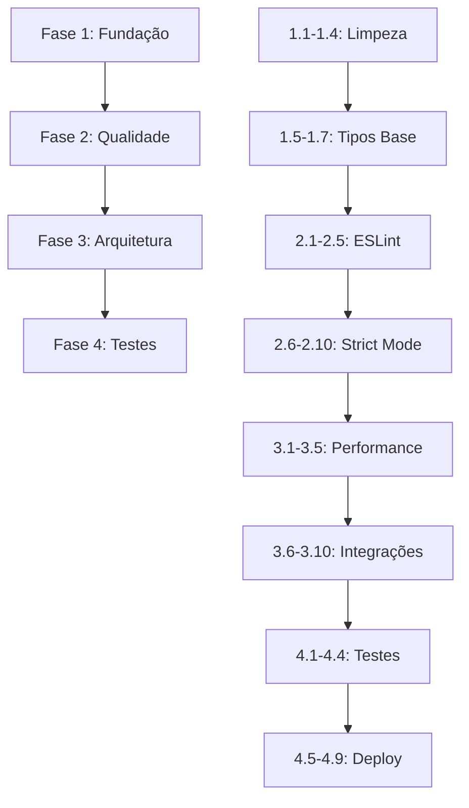

# 🗺️ ROADMAP - DuduFisio-AI Refactoring & Improvement Plan

**Data de Criação:** 2025-10-18
**Status:** 📋 PLANEJAMENTO COMPLETO
**Duração Estimada:** 6-8 semanas
**Objetivo:** Zero erros TypeScript/ESLint + Features completas + Performance otimizada

---

## 📊 RESUMO EXECUTIVO

### Situação Atual (Baseline - 2025-10-18)

| Métrica | Valor Atual | Meta | Status |
|---------|-------------|------|--------|
| **Erros TypeScript** | 89 erros | 0 erros | 🔴 Crítico |
| **Warnings ESLint** | 100+ warnings | < 10 warnings | 🟡 Importante |
| **Strict Mode** | Desabilitado | Habilitado | 🔴 Crítico |
| **Code Splitting** | Desabilitado | Habilitado | 🟡 Importante |
| **Imports Next.js** | 11 arquivos | 0 arquivos | 🔴 Crítico |
| **Cobertura Testes** | ~30% | 60%+ | 🟢 Desejável |
| **Bundle Size** | Baseline | -15% | 🟢 Desejável |
| **Componentes Duplicados** | ~15 duplicatas | 0 duplicatas | 🟡 Importante |

### Problemas Categorizados

#### 🔴 **CRÍTICOS** (Bloqueiam produção)
1. **11 arquivos** com imports de Next.js (projeto é Vite)
2. **TypeScript Strict Mode** completamente desabilitado
3. **89 erros TypeScript** que impedem builds com strict mode
4. **4 módulos** com exports faltando (`geminiService`, types)

#### 🟡 **IMPORTANTES** (Degradam qualidade)
5. **Code Splitting desabilitado** → Bundle grande
6. **100+ warnings ESLint** → Código não limpo
7. **15+ componentes duplicados** → Manutenção difícil
8. **11 arquivos** excluídos mas ainda presentes

#### 🟢 **MELHORIAS** (Aumentam valor)
9. **Features incompletas** (Gamificação, Vouchers, AR/Blockchain)
10. **Cobertura de testes baixa** (~30%)
11. **Documentação** desatualizada em partes
12. **Performance** pode melhorar (lazy loading, caching)

---

## 🎯 FASES DO ROADMAP

### **FASE 1: FUNDAÇÃO** (Semanas 1-2) 🔴
**Objetivo:** Corrigir problemas críticos que bloqueiam progresso

#### Semana 1: Limpeza Crítica
- **1.1** Remover/Corrigir imports de Next.js (11 arquivos)
- **1.2** Adicionar exports faltando (`geminiService`, types)
- **1.3** Corrigir imports de ícones faltando (Clock, XCircle, Badge, etc.)
- **1.4** Remover ou reintegrar 11 arquivos excluídos do tsconfig

**Entregáveis:**
- ✅ Zero imports de Next.js
- ✅ Todos os services exportando corretamente
- ✅ Todos os ícones importados
- ✅ tsconfig.json limpo

**Critérios de Sucesso:**
- Build sem erros de imports
- `npm run dev` funciona sem warnings de modules
- Nenhum erro de "module not found"

---

#### Semana 2: Correções de Tipos Base
- **1.5** Corrigir types.ts (adicionar propriedades faltando)
  - `Patient.main_pathology`, `Patient.main_pathology_region`
  - `PatientGoal.completedAt`, `PatientGoal.achievedAt`
  - `Surgery.recoveryTimeDays` (renomear de `recoveryTime`)
- **1.6** Corrigir enums e literais
  - `AppointmentStatus` vs strings literais
  - `PatientStatus` vs strings
  - `InventoryAlertType` propriedades faltando
- **1.7** Corrigir interfaces de componentes
  - `AppointmentTooltipProps` (adicionar children)
  - `LeadDetailPanelProps` (adicionar lead)

**Entregáveis:**
- ✅ types.ts completo e atualizado
- ✅ Enums alinhados com uso
- ✅ Interfaces de props corretas

**Critérios de Sucesso:**
- Redução de 50% dos erros TypeScript (89 → ~45)
- Componentes principais sem erros de tipo

---

### **FASE 2: QUALIDADE DE CÓDIGO** (Semanas 3-4) 🟡
**Objetivo:** Eliminar warnings e melhorar qualidade geral

#### Semana 3: Limpeza ESLint
- **2.1** Remover variáveis não usadas (50+ instances)
- **2.2** Remover console.log em produção (20+ instances)
- **2.3** Corrigir non-null assertions (10+ instances)
- **2.4** Corrigir arquivos checkly/ (4 parsing errors)
- **2.5** Consolidar componentes duplicados (15 duplicatas)

**Entregáveis:**
- ✅ ESLint warnings < 20
- ✅ Zero console.log em produção
- ✅ Zero non-null assertions desnecessárias
- ✅ Componentes consolidados

**Critérios de Sucesso:**
- `npm run lint` com < 20 warnings
- Build size reduzido em 5-10%

---

#### Semana 4: TypeScript Strict Mode
- **2.6** Habilitar `strictNullChecks: true`
- **2.7** Corrigir erros de null/undefined
- **2.8** Habilitar `noImplicitAny: true`
- **2.9** Corrigir tipos implícitos restantes
- **2.10** Habilitar modo `strict: true`

**Entregáveis:**
- ✅ Strict mode habilitado
- ✅ Zero erros TypeScript
- ✅ 100% type coverage

**Critérios de Sucesso:**
- `npm run type-check` sem erros
- tsconfig.json com `strict: true`

---

### **FASE 3: ARQUITETURA** (Semanas 5-6) 🟢
**Objetivo:** Melhorar arquitetura e performance

#### Semana 5: Code Splitting & Performance
- **3.1** Investigar problema de ordenação de chunks do Vite
- **3.2** Implementar estratégia alternativa de code splitting
- **3.3** Otimizar lazy loading de componentes
- **3.4** Implementar prefetching inteligente
- **3.5** Configurar Sentry para error tracking

**Entregáveis:**
- ✅ Code splitting funcionando
- ✅ Bundle reduzido em 10-15%
- ✅ Sentry configurado
- ✅ Service Worker otimizado

**Critérios de Sucesso:**
- Build time reduzido em 20%
- Bundle inicial < 300KB (gzipped)
- Lighthouse score > 90

---

#### Semana 6: Integrações Completas
- **3.6** Completar integração WhatsApp Web Client
- **3.7** Configurar backup multi-cloud (AWS/GCP)
- **3.8** Implementar gamificação completa
- **3.9** Finalizar sistema de vouchers
- **3.10** Completar portal do paciente

**Entregáveis:**
- ✅ WhatsApp 100% funcional
- ✅ Backup automático configurado
- ✅ Gamificação ativa
- ✅ Vouchers integrados com Stripe
- ✅ Portal do paciente completo

**Critérios de Sucesso:**
- Todas as integrações testadas e documentadas
- Features ativas em produção

---

### **FASE 4: TESTES & DOCUMENTAÇÃO** (Semanas 7-8) 🟢
**Objetivo:** Ampliar cobertura e documentar mudanças

#### Semana 7: Testes
- **4.1** Criar testes unitários para services críticos
- **4.2** Criar testes E2E para fluxos principais
- **4.3** Atingir 60% de cobertura de testes
- **4.4** Configurar CI/CD para rodar testes

**Entregáveis:**
- ✅ 100+ testes unitários
- ✅ 20+ testes E2E
- ✅ 60%+ cobertura
- ✅ CI/CD com testes

**Critérios de Sucesso:**
- Todos os testes passando
- Cobertura > 60%
- Testes rodando no CI

---

#### Semana 8: Documentação & Deploy
- **4.5** Atualizar toda documentação
- **4.6** Criar guia de migração
- **4.7** Documentar novas features
- **4.8** Deploy em produção
- **4.9** Monitoramento pós-deploy

**Entregáveis:**
- ✅ Docs atualizadas
- ✅ Guia de migração
- ✅ Deploy em produção
- ✅ Monitoring ativo

**Critérios de Sucesso:**
- Docs 100% atualizadas
- Deploy sem incidentes
- Zero erros em produção

---

## 📈 MÉTRICAS DE SUCESSO

### KPIs Técnicos

| Métrica | Baseline | Meta | Como Medir |
|---------|----------|------|------------|
| Erros TypeScript | 89 | 0 | `npm run type-check` |
| Warnings ESLint | 100+ | < 10 | `npm run lint` |
| Build Time | Atual | -20% | `time npm run build` |
| Bundle Size (gzip) | Atual | -15% | `npm run build:check` |
| Lighthouse Score | ? | > 90 | Lighthouse CI |
| Test Coverage | 30% | 60% | `npm run test:coverage` |
| TypeScript Strict | OFF | ON | tsconfig.json |

### KPIs de Negócio

| Métrica | Baseline | Meta |
|---------|----------|------|
| Features Completas | 22/28 (78%) | 28/28 (100%) |
| Componentes Duplicados | 15 | 0 |
| Imports Incorretos | 11 | 0 |
| Tempo de Onboarding | ? | -30% |
| Bugs em Produção | ? | -50% |

---

## 🚀 QUICK WINS (Primeiras 48h)

Tarefas que podem ser feitas IMEDIATAMENTE com alto impacto:

### Sprint 0 (Dia 1 - Manhã)
1. **Remover console.log** (20 arquivos) - 1h
2. **Remover variáveis não usadas** (50+ instances) - 2h
3. **Adicionar exports faltando** - 1h

### Sprint 0 (Dia 1 - Tarde)
4. **Corrigir imports de ícones** - 2h
5. **Corrigir tipos básicos** (Patient, Surgery) - 2h

### Sprint 0 (Dia 2)
6. **Corrigir imports Next.js** (11 arquivos) - 4h
7. **Consolidar componentes duplicados** (começar) - 4h

**Impacto Esperado após 48h:**
- Redução de 40-50% dos erros TypeScript
- Redução de 60-70% dos warnings ESLint
- Build mais rápido
- Código mais limpo

---

## 🛡️ GESTÃO DE RISCOS

### Riscos Identificados

| Risco | Probabilidade | Impacto | Mitigação |
|-------|--------------|---------|-----------|
| **Breaking changes em strict mode** | Alta | Alto | Habilitar gradualmente, testar cada flag |
| **Code splitting quebrar app** | Média | Alto | Testar extensivamente, rollback preparado |
| **Integração WhatsApp falhar** | Média | Médio | Manter mock funcionando, documentar |
| **Perda de performance** | Baixa | Alto | Benchmarks antes/depois, monitorar |
| **Conflitos em PRs grandes** | Alta | Médio | PRs pequenos e frequentes |
| **Testes quebrarem** | Alta | Médio | Atualizar testes junto com mudanças |

### Estratégias de Mitigação

1. **Mudanças Incrementais**
   - PRs pequenos (< 500 linhas)
   - Merge frequente (diário)
   - Feature flags para novas funcionalidades

2. **Testing Rigoroso**
   - Testes em cada PR
   - Smoke tests antes de merge
   - Testes E2E em staging

3. **Rollback Preparado**
   - Tags de versão em cada deploy
   - Script de rollback automático
   - Monitoramento de erros

4. **Comunicação Clara**
   - Daily standups
   - Status reports semanais
   - Documentação inline

---

## 📋 DEPENDÊNCIAS ENTRE FASES



**Bloqueadores Críticos:**
- Fase 2 **não pode começar** antes de Fase 1 completa
- Strict Mode (2.6-2.10) **requer** tipos base corrigidos (1.5-1.7)
- Code Splitting (3.1-3.5) **requer** zero erros TypeScript
- Deploy (4.8) **requer** 60%+ cobertura de testes

---

## 👥 EQUIPE RECOMENDADA

| Papel | Responsabilidades | Dedicação |
|-------|------------------|-----------|
| **Tech Lead** | Decisões arquiteturais, code review | 100% (8 semanas) |
| **Dev Senior** | Implementação core, refactoring | 100% (8 semanas) |
| **Dev Mid** | Correções, testes, docs | 100% (8 semanas) |
| **QA** | Testes E2E, validação | 50% (semanas 6-8) |
| **DevOps** | CI/CD, deploy, monitoring | 25% (semanas 7-8) |

**Total Effort:** ~24 person-weeks

---

## 📅 CRONOGRAMA VISUAL

```
SEMANA | FASE           | TAREFAS PRINCIPAIS
-------|----------------|--------------------------------------------------
  1    | 🔴 Fundação    | ███████████ Remover Next.js, Exports, Ícones
  2    | 🔴 Fundação    | ████████████ Corrigir types.ts, Enums, Interfaces
  3    | 🟡 Qualidade   | ██████████ Limpar ESLint, Consolidar Componentes
  4    | 🟡 Qualidade   | ████████████ Habilitar Strict Mode
  5    | 🟢 Arquitetura | ██████████ Code Splitting, Performance
  6    | 🟢 Arquitetura | ███████████ Completar Integrações
  7    | 🟢 Testes      | ████████████ Testes Unitários/E2E
  8    | 🟢 Deploy      | ██████████ Docs, Deploy, Monitoring
```

**Marcos (Milestones):**
- 🎯 **Semana 2:** Zero erros de imports, types base corretos
- 🎯 **Semana 4:** Strict mode ativado, < 20 warnings
- 🎯 **Semana 6:** Code splitting funcionando, features completas
- 🎯 **Semana 8:** Deploy em produção, 60%+ cobertura

---

## 🎓 LIÇÕES APRENDIDAS & BEST PRACTICES

### O Que Evitar
❌ PRs grandes (> 500 linhas)
❌ Habilitar strict mode de uma vez
❌ Mudar muitos arquivos simultaneamente
❌ Deployar sem testes
❌ Ignorar warnings "pequenos"

### O Que Fazer
✅ PRs pequenos e frequentes
✅ Habilitar strict mode gradualmente
✅ Testar cada mudança
✅ Code review rigoroso
✅ Monitorar métricas continuamente
✅ Documentar decisões arquiteturais

---

## 📞 COMUNICAÇÃO

### Status Reports Semanais
- **Quando:** Toda sexta-feira
- **Formato:** Documento com progresso, blockers, próximos passos
- **Para:** Stakeholders, equipe

### Daily Standups
- **Quando:** Todo dia 9h
- **Duração:** 15min
- **Formato:** O que fiz / Farei / Bloqueios

### Code Reviews
- **SLA:** < 24h para review
- **Regra:** 2 approvals mínimo
- **Critério:** Checklist de qualidade

---

## ✅ DEFINITION OF DONE

Uma tarefa está **COMPLETA** quando:

1. ✅ Código implementado e testado localmente
2. ✅ Testes unitários passando (se aplicável)
3. ✅ Testes E2E passando (se aplicável)
4. ✅ Code review aprovado (2+ approvals)
5. ✅ Documentação atualizada
6. ✅ `npm run type-check` sem erros
7. ✅ `npm run lint` sem warnings novos
8. ✅ Build de produção sucesso
9. ✅ Merge na branch main
10. ✅ Deploy em staging validado

---

## 🎉 CRITÉRIOS DE SUCESSO FINAL

O projeto será considerado **100% COMPLETO** quando:

### Técnicos
- [ ] **Zero erros TypeScript** com strict mode ON
- [ ] **< 10 warnings ESLint** no código
- [ ] **Zero imports incorretos** (Next.js, etc.)
- [ ] **Code splitting funcionando** corretamente
- [ ] **Bundle reduzido em 15%+**
- [ ] **Build time reduzido em 20%+**
- [ ] **Lighthouse score > 90**

### Funcionalidades
- [ ] **28/28 features completas** e documentadas
- [ ] **Zero componentes duplicados**
- [ ] **Todas integrações funcionando** (WhatsApp, Stripe, etc.)
- [ ] **Portal do paciente 100%**
- [ ] **Gamificação ativa**
- [ ] **Sistema de vouchers completo**

### Qualidade
- [ ] **60%+ cobertura de testes**
- [ ] **100+ testes unitários**
- [ ] **20+ testes E2E**
- [ ] **CI/CD configurado**
- [ ] **Sentry monitoring ativo**
- [ ] **Zero bugs críticos em produção**

### Documentação
- [ ] **Docs 100% atualizadas**
- [ ] **Guia de migração criado**
- [ ] **ADRs documentados**
- [ ] **Changelog completo**

---

## 📚 PRÓXIMOS PASSOS

### Agora (Esta Semana)
1. ✅ Aprovar este roadmap
2. ✅ Ler [TASKS.md](./TASKS.md) para detalhes
3. ✅ Ler [QUICK_WINS.md](./QUICK_WINS.md) para começar
4. ✅ Criar branch `refactor/phase-1-foundation`
5. ✅ Começar Quick Wins (48h)

### Semana 1
6. ✅ Implementar tarefas 1.1-1.4 (Fase 1 Semana 1)
7. ✅ Daily standups e status reports
8. ✅ Code reviews e merges

### Próximas Semanas
9. ✅ Seguir cronograma fase a fase
10. ✅ Ajustar conforme necessário
11. ✅ Celebrar marcos alcançados! 🎉

---

**Última Atualização:** 2025-10-18
**Autor:** Claude AI (Assistant)
**Status:** ✅ Pronto para Execução

**Aprovação Necessária:** [ ] Tech Lead  [ ] Product Owner  [ ] CTO
