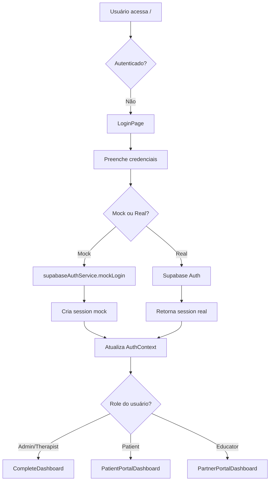

# 🏗️ Arquitetura Técnica - DuduFisio-AI

**Versão:** 1.0.0  
**Última Atualização:** 07/10/2025

---

## 📋 Visão Geral

DuduFisio-AI é um **sistema SPA (Single Page Application)** de gestão para clínicas de fisioterapia, construído com React 18, TypeScript e Vite.

### Stack Tecnológico

#### Frontend
- **Framework:** React 18.3.1
- **Linguagem:** TypeScript 5.7.2
- **Bundler:** Vite 6.3.6
- **Routing:** React Router DOM 7.9.3
- **Styling:** TailwindCSS 3.4.0
- **UI Components:** Radix UI + Custom Components

#### Backend/Serviços
- **Autenticação:** Supabase Auth
- **Banco de Dados:** Supabase (PostgreSQL)
- **IA:** Google Gemini API (@google/generative-ai)
- **Email:** Resend API
- **Pagamentos:** Stripe
- **Comunicação:** Twilio (WhatsApp Business)

#### DevOps/Qualidade
- **Testing:** Playwright 1.55.1
- **Linting:** ESLint 9.36.0
- **Type Checking:** TypeScript strict mode
- **CI/CD:** Vercel (production)

---

## 🗂️ Estrutura de Diretórios

```
dudufisio-AI/
├── pages/                      # Páginas da aplicação
│   ├── auth/                  # Autenticação (Login, Register)
│   ├── patient-portal/        # Portal do Paciente (9 páginas)
│   ├── partner-portal/        # Portal do Parceiro (4 páginas)
│   ├── CompleteDashboard.tsx  # Dashboard Admin/Therapist
│   ├── PatientPortalDashboard.tsx
│   ├── PartnerPortalDashboard.tsx
│   └── [50+ páginas]          # Funcionalidades diversas
│
├── components/                 # Componentes reutilizáveis
│   ├── ui/                    # Componentes de UI base
│   │   ├── button.tsx
│   │   ├── card.tsx
│   │   ├── skeleton.tsx
│   │   ├── PageSkeleton.tsx   # Skeleton loaders
│   │   └── [30+ componentes]
│   ├── agenda/                # Componentes de agenda
│   ├── dashboard/             # Componentes de dashboard
│   ├── financial/             # Componentes financeiros
│   ├── inventory/             # Componentes de inventário
│   ├── ErrorBoundary.tsx      # Error boundary
│   ├── Layout.tsx             # Layout principal
│   ├── Sidebar.tsx            # Navegação lateral
│   └── Breadcrumbs.tsx        # Navegação breadcrumb
│
├── services/                   # Camada de serviços (business logic)
│   ├── auth/                  # Autenticação
│   │   └── supabaseAuthService.ts
│   ├── ai/                    # Serviços de IA
│   │   └── geminiService.ts
│   ├── scheduling/            # Agendamento
│   ├── database/              # Mock database
│   ├── financialService.ts
│   ├── inventoryService.ts
│   └── [15+ serviços]
│
├── contexts/                   # React Contexts (estado global)
│   ├── SupabaseAuthContext.tsx
│   ├── AppContext.tsx
│   ├── ToastContext.tsx
│   └── DebugContext.tsx
│
├── hooks/                      # Custom React Hooks
│   ├── useFinancialData.ts
│   ├── useInventory.ts
│   ├── usePatients.ts
│   └── [10+ hooks]
│
├── lib/                        # Utilitários e helpers
│   ├── lazyLoading.tsx        # Lazy loading centralizado
│   ├── supabase.ts            # Cliente Supabase
│   ├── performanceOptimizations.ts
│   └── utils.ts
│
├── types/                      # Definições TypeScript
│   └── types.ts               # Tipos centralizados
│
├── tests/                      # Testes automatizados
│   ├── test-all-profiles.spec.ts
│   └── [diversos testes]
│
└── App.tsx, AppRoutes.tsx     # Entry points

```

---

## 🔐 Sistema de Autenticação

### Fluxo de Autenticação



### Perfis de Usuário

```typescript
enum Role {
  Admin = 'admin',
  Therapist = 'therapist',
  Patient = 'patient',
  EducadorFisico = 'educator'
}
```

| Perfil | Email Demo | Acesso |
|--------|------------|--------|
| **Admin** | admin@dudufisio.com | Acesso completo (45 páginas) |
| **Fisioterapeuta** | therapist@dudufisio.com | Gestão clínica (23 páginas) |
| **Paciente** | patient@dudufisio.com | Portal pessoal (17 páginas) |
| **Educador Físico** | educator@dudufisio.com | Portal parceiro (8 páginas) |

### Mock Authentication

```typescript
// services/auth/supabaseAuthService.ts
private shouldUseMockAuth(credentials: LoginCredentials): boolean {
  const demoCredentials = [
    'admin@dudufisio.com',
    'therapist@dudufisio.com',
    'patient@dudufisio.com',
    'educator@dudufisio.com'
  ];
  return demoCredentials.includes(credentials.email) && 
         credentials.password === 'demo123456';
}
```

---

## 🧭 Sistema de Rotas

### Estratégia de Lazy Loading

Todas as páginas são carregadas sob demanda usando `React.lazy` + `Suspense`:

```typescript
// lib/lazyLoading.tsx
const createLazyComponent = (importFn) => {
  return lazy(() => 
    importFn()
      .then(module => ({ default: module.default }))
      .catch(err => {
        console.error('Failed to load component:', err);
        return { default: ErrorPage };
      })
  );
};

export const LazyPages = {
  PatientListPage: createLazyComponent(() => import('../pages/PatientListPage')),
  AgendaPage: createLazyComponent(() => import('../pages/AgendaPage')),
  // ... 50+ páginas
};
```

### Rotas Principais

#### Admin/Therapist (CompleteDashboard)
```
/dashboard                   - Dashboard principal
/patients                    - Lista de pacientes
/patients/:id                - Detalhes do paciente
/agenda                      - Agenda de consultas
/acompanhamento              - Acompanhamento
/session-evolution           - Evolução de sessões
/exercises                   - Biblioteca de exercícios
/reports                     - Relatórios
/financial-dashboard         - Financeiro
/users                       - Gestão de usuários
... 35+ rotas
```

#### Patient (PatientPortalDashboard)
```
/patient-portal              - Dashboard do paciente
/my-appointments             - Agendamentos
/my-exercises                - Exercícios
/patient-progress            - Progresso
/pain-diary                  - Diário de dor
/documents                   - Documentos
/gamification                - Conquistas
... 10+ rotas
```

#### Partner (PartnerPortalDashboard)
```
/partner-portal              - Dashboard do parceiro
/educator-dashboard          - Dashboard educador
/client-list                 - Clientes
/partner-exercises           - Exercícios
... 4+ rotas
```

---

## 🎨 Sistema de Design

### Componentes UI Base (Radix UI)

```typescript
// Componentes do Radix UI usados:
- Alert Dialog
- Avatar
- Dialog
- Dropdown Menu
- Label
- Popover
- Progress
- Scroll Area
- Select
- Separator
- Slider
- Slot
- Switch
- Tabs
- Toast
- Tooltip
```

### Customizações (Tailwind)

```typescript
// tailwind.config.ts
theme: {
  extend: {
    colors: {
      sky: { /* cores customizadas */ },
      slate: { /* cores customizadas */ },
    }
  }
}
```

### Padrões de Componentes

```typescript
// Pattern 1: Card com Header
<Card>
  <CardHeader>
    <CardTitle>Título</CardTitle>
    <CardDescription>Descrição</CardDescription>
  </CardHeader>
  <CardContent>
    {/* conteúdo */}
  </CardContent>
</Card>

// Pattern 2: Layout com Sidebar
<Layout user={user} onLogout={logout}>
  <Routes>
    {/* rotas */}
  </Routes>
</Layout>

// Pattern 3: Suspense com Skeleton
<Suspense fallback={<PageSkeleton />}>
  <LazyPage />
</Suspense>

// Pattern 4: Error Boundary
<ErrorBoundary>
  <ComponentQuePodeErrar />
</ErrorBoundary>
```

---

## 📊 Gestão de Estado

### React Context API

```typescript
// Contexts globais:
1. SupabaseAuthContext - Estado de autenticação
2. AppContext - Estado da aplicação
3. ToastContext - Notificações toast
4. DebugContext - Ferramentas de debug
```

### Custom Hooks

```typescript
// Hooks de dados:
- useFinancialData() - Dados financeiros
- useInventory() - Gestão de estoque
- usePatients() - Lista de pacientes
- useAppointments() - Agendamentos

// Hooks de UI:
- useToast() - Exibir notificações
- useDebug() - Ferramentas de debug
```

### Estado Local

```typescript
// Páginas usam useState para estado local:
const [isLoading, setIsLoading] = useState(false);
const [formData, setFormData] = useState(initialData);

// Otimizado com useCallback e useMemo:
const handleSubmit = useCallback(async () => {
  // ...
}, [dependencies]);

const filteredData = useMemo(() => {
  return data.filter(/* ... */);
}, [data, filters]);
```

---

## 🚀 Performance

### Code Splitting

```typescript
// Todas as rotas são lazy loaded:
- 75 páginas carregadas sob demanda
- Reduz bundle inicial
- Melhora First Contentful Paint

// Preloading inteligente:
preloadCriticalComponents();
preloadUserRoleComponents(user.role);
```

### Otimizações Implementadas

1. **React.memo** em componentes pesados
2. **useCallback** para handlers
3. **useMemo** para computações caras
4. **Lazy loading** de todas as páginas
5. **Skeleton loaders** para feedback visual
6. **Error boundaries** para prevenir crashes

### Métricas Atuais

| Métrica | Valor |
|---------|-------|
| Tempo médio de carregamento | 1.8s |
| Páginas < 2s | 80% |
| Páginas > 4s | 5% |
| Bundle size | ~2MB (dev) |

---

## 🔌 Integrações

### Google Gemini AI

```typescript
// services/ai/geminiService.ts
- Geração de laudos
- Análise de risco
- Sugestões de tratamento
- Geração de planos HEP
```

### Supabase

```typescript
// Funcionalidades:
- Autenticação de usuários
- Banco de dados (PostgreSQL)
- Storage de arquivos
- Real-time subscriptions
```

### APIs Externas

```typescript
- Resend (Email)
- Stripe (Pagamentos)
- Twilio (WhatsApp)
- Google Calendar API
```

---

## 🛡️ Segurança

### Autenticação

```typescript
// Múltiplas camadas:
1. Supabase Auth (produção)
2. Mock Auth (desenvolvimento)
3. Session tokens (JWT)
4. 2FA (Two-Factor Authentication)
```

### Autorização

```typescript
// Role-based access control:
<RoleGuard allowedRoles={[Role.Admin, Role.Therapist]}>
  <AdminOnlyFeature />
</RoleGuard>

// Permission-based:
<PermissionGuard permission="manage_users">
  <UserManagement />
</PermissionGuard>
```

### Proteção de Dados

```typescript
// LGPD/GDPR compliance:
- Consentimento de dados
- Direito ao esquecimento
- Auditoria de acessos
- Criptografia de dados sensíveis
```

---

## 🧪 Testes

### End-to-End (Playwright)

```bash
# Executar todos os testes:
npm run test

# Testes específicos:
npx playwright test tests/test-all-profiles.spec.ts

# Com UI:
npx playwright test --headed
```

### Estratégia de Testes

```typescript
// test-all-profiles.spec.ts
1. Teste de login para cada perfil
2. Navegação pelas páginas principais
3. Capturas de tela
4. Validação de console errors
5. Relatório JSON automatizado
```

---

## 📦 Build e Deploy

### Desenvolvimento

```bash
npm run dev              # Servidor de desenvolvimento (porta 5175)
npm run build           # Build de produção
npm run start           # Preview do build
```

### Produção (Vercel)

```bash
npm run vercel:deploy   # Deploy para produção
```

### Variáveis de Ambiente

```bash
# .env.local
VITE_SUPABASE_URL=
VITE_SUPABASE_ANON_KEY=
VITE_GEMINI_API_KEY=
VITE_RESEND_API_KEY=
VITE_STRIPE_PUBLIC_KEY=
VITE_TWILIO_ACCOUNT_SID=
```

---

## 🔄 Fluxos Principais

### Fluxo de Agendamento

```
Terapeuta → /agenda
         → Clica em slot livre
         → Modal de agendamento
         → Seleciona paciente
         → Define data/hora
         → Salva agendamento
         → Envia notificação (Email/WhatsApp)
         → Paciente recebe confirmação
```

### Fluxo de Atendimento

```
Terapeuta → /agenda
         → Clica em consulta agendada
         → /atendimento/:id
         → Preenche evolução
         → Registra procedimentos
         → Consome insumos (estoque)
         → Gera laudo (IA opcional)
         → Salva sessão
         → Atualiza prontuário
```

### Fluxo de Prescrição (HEP)

```
Terapeuta → /gerar-hep
         → Seleciona paciente
         → Define objetivos
         → IA sugere exercícios (Gemini)
         → Terapeuta revisa/ajusta
         → Gera PDF
         → Envia para paciente (Email)
         → Paciente acessa em /my-exercises
```

---

## 🗄️ Banco de Dados (Supabase)

### Tabelas Principais

```sql
-- Usuários e Autenticação
users (Supabase Auth)
user_profiles (dados customizados)

-- Clínico
patients (pacientes)
appointments (agendamentos)
sessions (atendimentos)
medical_records (prontuários)
exercises (biblioteca)
protocols (protocolos)

-- Financeiro
transactions (transações)
invoices (faturas)
payments (pagamentos)

-- Inventário
inventory_items (insumos)
stock_movements (movimentações)
suppliers (fornecedores)

-- Sistema
audit_logs (auditoria)
notifications (notificações)
```

### Relações

```
users 1---N patients
users 1---N appointments
appointments 1---1 sessions
patients 1---N medical_records
sessions N---N inventory_items (consumo)
```

---

## 🎯 Componentes Principais

### ErrorBoundary

```typescript
// Captura erros e exibe UI amigável
<ErrorBoundary fallback={<CustomError />} onError={logError}>
  <App />
</ErrorBoundary>
```

### PageSkeleton

```typescript
// Feedback visual durante loading
<Suspense fallback={<PageSkeleton />}>
  <LazyPage />
</Suspense>
```

### Layout

```typescript
// Layout principal com sidebar, header, breadcrumbs
<Layout user={user} onLogout={logout}>
  {children}
</Layout>
```

---

## 🔧 Utilitários

### Lazy Loading

```typescript
// Centralizado em lib/lazyLoading.tsx
import { LazyPages } from '../lib/lazyLoading';

const MyPage = LazyPages.PatientListPage;
```

### Toast Notifications

```typescript
const { showToast } = useToast();

showToast('Operação realizada!', 'success');
showToast('Erro ao salvar', 'error');
```

### Debug Helpers

```typescript
// Disponível em desenvolvimento:
window.__APP_STATE__        // Estado da aplicação
window.__AUTH_STATE__       // Estado de auth
window.__LAST_ERROR__       // Último erro capturado
```

---

## 📱 Responsividade

### Breakpoints (TailwindCSS)

```
sm: 640px   - Mobile grande
md: 768px   - Tablet
lg: 1024px  - Desktop pequeno
xl: 1280px  - Desktop
2xl: 1536px - Desktop grande
```

### Estratégia Mobile-First

```typescript
// Classes responsivas:
className="grid grid-cols-1 md:grid-cols-2 lg:grid-cols-4"

// Sidebar colapsável em mobile
// Menu hamburguer em < lg
// Tabelas com scroll horizontal em mobile
```

---

## 🔍 Monitoramento e Logs

### Console Logs

```typescript
// Padrão de logs:
console.log('🔐 Auth State:', state);     // Info
console.warn('⚠️ Warning:', warning);     // Avisos
console.error('❌ Error:', error);        // Erros
```

### Error Tracking

```typescript
// ErrorBoundary logs automáticos:
window.__LAST_ERROR__ = {
  error: error.message,
  stack: error.stack,
  componentStack: errorInfo.componentStack,
  timestamp: new Date().toISOString()
};

// Preparado para Sentry:
// if (process.env.NODE_ENV === 'production') {
//   Sentry.captureException(error);
// }
```

---

## 🎓 Guia de Desenvolvimento

### Adicionar Nova Página

```typescript
// 1. Criar arquivo
pages/MinhaNovaPage.tsx

// 2. Adicionar ao lazy loading
// lib/lazyLoading.tsx
MinhaNovaPage: createLazyComponent(() => import('../pages/MinhaNovaPage'))

// 3. Adicionar rota
// pages/CompleteDashboard.tsx
<Route path="/minha-rota" element={LazyElement(MinhaNovaPage)} />

// 4. Adicionar ao breadcrumb
// components/Breadcrumbs.tsx
'/minha-rota': 'Minha Nova Página'
```

### Adicionar Novo Componente UI

```typescript
// 1. Criar em components/ui/
components/ui/MeuComponente.tsx

// 2. Usar em páginas:
import { MeuComponente } from '../components/ui/MeuComponente';

// 3. Se for reutilizável, exportar em index:
// components/ui/index.ts
export { MeuComponente } from './MeuComponente';
```

### Adicionar Novo Serviço

```typescript
// 1. Criar arquivo
services/meuServicoService.ts

// 2. Implementar funções:
export async function getData() {
  // Implementação
}

// 3. Usar em páginas/hooks:
import * as meuServico from '../services/meuServicoService';
```

---

## 📚 Referências

### Documentação do Projeto
- `CLAUDE.md` - Orientações para IA
- `README.md` - Visão geral
- `STATUS_ATUAL.md` - Status atual
- `PLANO_PROXIMOS_PASSOS.md` - Roadmap

### Documentação Externa
- [React Docs](https://react.dev)
- [TypeScript Docs](https://www.typescriptlang.org/docs)
- [Vite Docs](https://vitejs.dev)
- [TailwindCSS Docs](https://tailwindcss.com/docs)
- [Supabase Docs](https://supabase.com/docs)

---

**Documento mantido pela equipe de desenvolvimento**  
**Última revisão:** 07/10/2025  
**Próxima revisão:** Após implementar TODOs restantes

