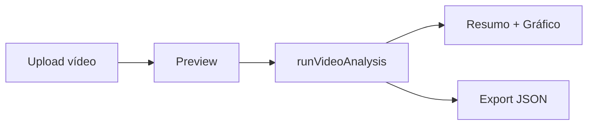

# 🤖 Movement Analysis MVP - Guia Técnico

**Status:** ✅ Evolução entregue em 07/11/2025  
**Responsável:** Equipe IA | Fase 4

---

## 1. Objetivo
Ampliar o MVP de análise de movimento com:
- Upload/gravação de vídeo e pré-visualização
- IA simulada (Gemini + PoseNet) para avaliação de amplitude
- Relatório com pontos fortes, melhorias e compensações
- Gráfico de evolução temporal
- Exportação em JSON para prontuário

---

## 2. Arquitetura
| Camada | Arquivo |
| --- | --- |
| UI principal | `features/video-movement-analysis/VideoMovementAnalysis.tsx` |
| Serviço IA mock | `services/videoMovementAnalysisService.ts` |
| Testes unitários | `__tests__/features/VideoMovementAnalysis.test.tsx` |
| Assets | Upload via input HTML5 (client-side) |

---

## 3. Fluxo
1. Usuário seleciona vídeo (`input[type=file]`).
2. Visualização imediata com controles (play, pause, restart).
3. Ao clicar **Analisar Movimento**, chamamos `runVideoAnalysis()`.
4. Serviço retorna métricas (score, consistência, amplitude, compensações).
5. UI exibe cartões, gráfico, lista de melhorias e exportação JSON.



---

## 4. Serviço IA Mock (`videoMovementAnalysisService.ts`)
- `runVideoAnalysis(file, exerciseType)` → `VideoAnalysisResult`
- `generateAnnotatedVideo(file, analysis)` → `Blob` (placeholder)
- Estrutura pronta para integrar TensorFlow.js / API externa.

### Resultado (excerpt)
```ts
interface VideoAnalysisResult {
  summary: {
    overallScore: number;
    rangeOfMotion: { joint: string; min: number; max: number; }[];
    movementQuality: { smoothness: number; compensation: string[]; };
    improvements: string[];
    strengths: string[];
  };
}
```

---

## 5. Testes Automatizados
Arquivo: `__tests__/features/VideoMovementAnalysis.test.tsx`
- Mock de `runVideoAnalysis`
- Simula upload de arquivo
- Clica no botão **Analisar Movimento**
- Verifica renderização do score e itens de relatório

Execução:
```bash
npx vitest run __tests__/features/VideoMovementAnalysis.test.tsx
```

---

## 6. Próximos Passos
- [ ] Integrar PoseNet real via TensorFlow.js
- [ ] Calibrar análise com base em ângulos reais do paciente
- [ ] Salvar relatório no Supabase (documento do paciente)
- [ ] Gerar vídeo anotado (MediaPipe + ffmpeg em Edge Function)
- [ ] Disponibilizar modo Live usando WebRTC

---

> Para dúvidas adicionais: consultar `minatto_gemini.md` (Fase 4) ou abrir issue `movement-analysis`.
